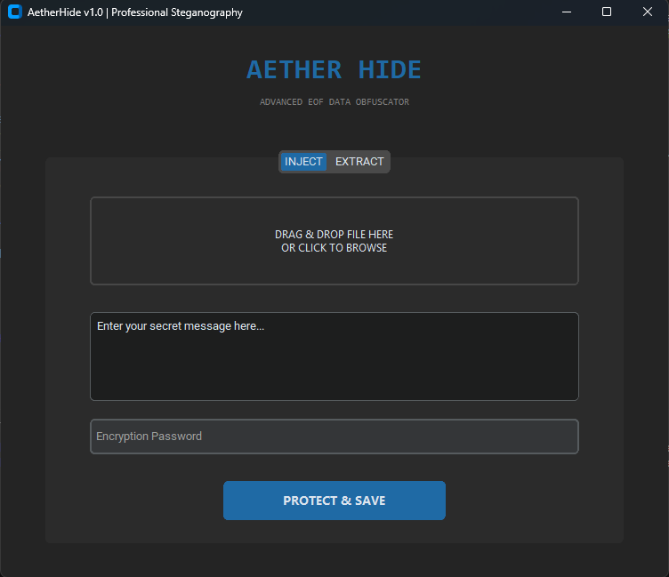

# 🌌 AetherHide v1.0
**Advanced EOF Steganography & Data Obfuscation Tool**

AetherHide is a professional-grade cybersecurity utility built in Python that allows you to hide encrypted messages within any file (Images, Videos, PDFs, etc.) without altering the original file's functionality. It utilizes the **EOF (End of File)** technique combined with **AES-256 encryption** to ensure your data remains invisible and secure.



## ✨ Key Features
* **Military-Grade Encryption:** Uses PBKDF2 for key derivation and AES-256 (Fernet) for data encryption.
* **EOF Steganography:** Appends data after the file's natural termination marker, keeping the carrier file fully functional.
* **Modern UI:** A clean, dark-themed interface built with `CustomTkinter`.
* **Drag & Drop Support:** Easily select target files by dropping them into the application.
* **Cross-Platform:** Works on Windows, Linux, and macOS.
* **Modular Architecture:** Clean and organized code structure for easy scalability.

## 🚀 Installation

1. **Clone the repository:**
   ```bash
   git clone https://github.com/aminmadaniofficial/AetherHide.git
   cd AetherHide
   ```

2. **Install dependencies:**
   ```bash
   pip install -r requirements.txt
   ```

3. **Run the application:**
   ```bash
   python main.py
   ```

## 🛠️ Technology Stack
* **Language:** Python 3.9+
* **GUI Framework:** CustomTkinter
* **Cryptography:** Python-Cryptography (Hazmat layer)
* **File Handling:** TkinterDnD2 (Cross-platform Drag & Drop)

## 📖 How It Works
AetherHide identifies the binary end-of-file marker of the carrier. It then generates a unique salt and derives a high-entropy key from your password. The encrypted payload is injected after the marker, followed by a unique Aether signature. Standard viewers/players stop reading at the original marker, while AetherHide scans beyond it to recover the hidden layer.

## 📂 Project Structure
```text
AetherHide/
├── core/
│   ├── engine.py       # Cryptographic & Injection Logic
│   └── __init__.py
├── gui/
│   ├── main_window.py  # CustomTkinter UI Implementation
│   └── __init__.py
├── main.py             # Entry Point
├── requirements.txt    # Project Dependencies
└── preview.png         # UI Preview Image
```

## ⚠️ Disclaimer
This tool is developed for **educational and ethical purposes** only. The developer is not responsible for any misuse or damage caused by this software. Always ensure you have permission before processing files that are not yours.

## 📄 License
Distributed under the MIT License. See `LICENSE` for more information.
```
